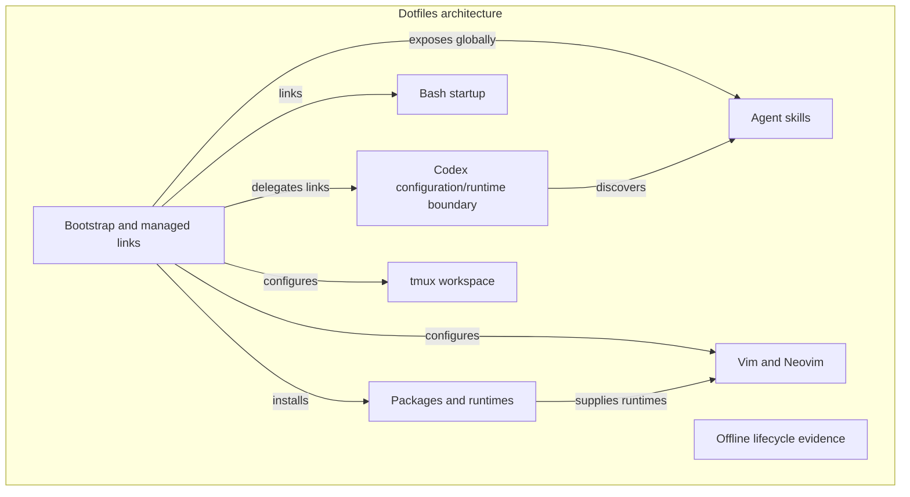

# Flywheel Repos trial — 2026-09-10

Updated the installed normal CLI from **0.1.136 to 0.1.143** and refreshed its
existing Codex skills. Node is **24.18.1**. The production login was already
usable. This follows the [local repository quickstart](https://docs.flywheel.paradigma.inc/quickstart)
and [installation requirements](https://docs.flywheel.paradigma.inc/install).

**Offline operations passed. Publication is blocked by production HTTP 409
`repository_migration_state_invalid`.** Both local commits remain intact.

## Local graph

The graph lives in this checkout's `.flywheel/db.sqlite`, independently of Git.
It contains nine nodes, eight containment assignments, and eight semantic edges.
Each subsystem node includes its behavior, useful commands, and source paths.



The map describes the inspected working tree at Git HEAD
`bb9e8e6f98aef3f42efec8c612df0d2b204e5db9`, including pre-existing README and
bootstrap edits. It is a selected architecture map, not a complete file inventory.
No secret values or Codex runtime files are included.

- Repository: `2d44305c-5a80-4806-bac2-8d669fc4bf2b`
- Graph root: `f11f22e1-59c9-4702-b9cf-620fca4b5e31`
- Node IDs and source payloads: `.flywheel/trial/nodes.json` and adjacent JSON files.

From the dotfiles root:

```sh
flywheel repo:status
flywheel repo:node:get f11f22e1-59c9-4702-b9cf-620fca4b5e31
flywheel repo:containment:list f11f22e1-59c9-4702-b9cf-620fca4b5e31
flywheel repo:edge:list f11f22e1-59c9-4702-b9cf-620fca4b5e31
flywheel repo:log
```

## Offline evidence

All initialization, creation, containment, edge, edit, commit, and verification
operations ran under macOS `sandbox-exec` with `(deny network*)`. The CLI was
installed beforehand; this was process-level network isolation, while the rest
of the machine stayed connected.

The process environment was cleared of API/admin keys. The sandbox also denied
reads of the Flywheel credential file and `~/.secrets`. A direct TCP probe to
`1.1.1.1:443` returned **EPERM**, proving the check did not depend only on DNS.

| Check | Result |
| --- | --- |
| Initialize project repository without network or credentials | Passed |
| Stage 9 nodes, 8 containment assignments, 8 semantic edges | Passed |
| Commit all 25 operations locally | Passed |
| Read every node field and edge body in fresh CLI processes | Exact match |
| Read a staged node through the public CLI before committing | Unavailable in 0.1.143 |
| Stage an edit and read the old committed content | Passed |
| Commit the edit separately and read the new content | Passed |
| `repo:doctor` | All 5 checks passed |
| Recheck offline after the failed online sync | Passed; staging empty |

Local commits:

1. `sha256:e6d49aac1c10a1339d51b98d4e6671abd09c68bbdb81d57b67b01e5d9aafdc8d`
   — initial architecture map, 25 operations.
2. `sha256:51246d3a19888e60d12a2ecb662192148cf44d9426e6bd0fce489e077086c401`
   — offline evidence edit, 1 operation; current local head.

Repeat the read-only integration check on this Mac:

```sh
cd /Users/giulio/repos/dotfiles
env -i HOME=/Users/giulio \
  PATH=/Users/giulio/.local/bin:/Users/giulio/n/bin:/usr/bin:/bin \
  /usr/bin/sandbox-exec -f .flywheel/trial/offline.sb \
  node .flywheel/trial/verify.mjs
```

Expected result: `PASS`, nine nodes, eight containments, eight edges, all doctor
checks passing, and `EPERM` for network and credential access. The check compares
the graph with this trial's saved payloads; intentional future graph edits require
updating those expectations. Do not rerun `build.mjs`: it is the original,
non-idempotent authoring script.

In CLI 0.1.143, `repo:node:get` reads committed content. `repo:status` and
`repo:diff` expose staging counts and metadata, but do not display staged node
content. The engine's internal `GET /staging` returns staged operations and latest
values; that endpoint has no public CLI command in the tested version. This is a
CLI usability gap, not evidence that staged content has been lost.

## Push failure

The first `repo:push --create-remote` created and attached a production repository
at `https://flywheel.paradigma.inc/api`. Publishing its commits then failed:

```text
POST /v1/repositories/2d44305c-5a80-4806-bac2-8d669fc4bf2b/pushes
409 {"detail":"repository_migration_state_invalid"}
request_id: 54133c49-b608-4588-ad50-4b3fd775f535
```

A retry with the same idempotency key also returned 409
(`request_id: 6eb6f136-1f59-47f6-9df9-a32690ef2ea0`). A fresh clone request failed
at `/clone-sessions` with the same error
(`request_id: 01bc6d77-0eb8-4170-a4d4-8d6d77f48660`). Hosted root-node lookup
returned 404. Local `remote_tracking` remains null: the graph is **not published**,
and a hosted round trip could not be verified.

These independent failures point to a hosted repository migration-state problem;
the underlying server cause was not inspected. Normal CLI operations could not
repair it. After the service issue is resolved, retry the unchanged local commits:

```sh
env -u FLYWHEEL_ADMIN_KEY flywheel repo:push \
  --repo /Users/giulio/repos/dotfiles \
  --idempotency-key c2b598ce-9221-450d-8b48-0a874e65dbf4 \
  --format=json
```

An additional path quirk: cloning into `/tmp/...` failed locally with
`repository_backup_location_unsupported`; the resolved `/private/tmp/...` path
passed local validation and reached the server's 409 response.

Raw command results, sandbox policy, source payloads, and verification are under
`.flywheel/trial/`, ignored by Git along with the graph database. Flywheel retains
a bootstrap lock in the parent directory's `.flywheel-runtime-locks/` by design.
The Codex home layout check passed. The original graph trial did not create a
Git commit; this report and the ignore rule are tracked separately from its data.

## Submitted feedback

Three separate reports were submitted through Flywheel's feedback endpoint:

| Feedback | ID |
| --- | --- |
| Installer offered admin CLI to a normal user | `34515cc3-7908-4b22-917d-0a85f2f738e1` |
| Public CLI cannot display staged node content | `f0eef70e-1220-49b3-bc66-987b88838d97` |
| Push and clone fail with `repository_migration_state_invalid` | `b93c9c93-5702-4139-ac2e-3bf4cf4e786a` |

The installer prompt came from the obsolete globally installed
`dev@paradigma-monorepo` plugin's `flywheel-installer` skill. The subsequent Codex
cleanup removed that marketplace and its internal plugins. Current Paradigma
internal skills are discovered from the monorepo checkout; the public Flywheel
skills remain available globally. The report payloads and responses are retained
locally in `.flywheel/trial/feedback-*`.
